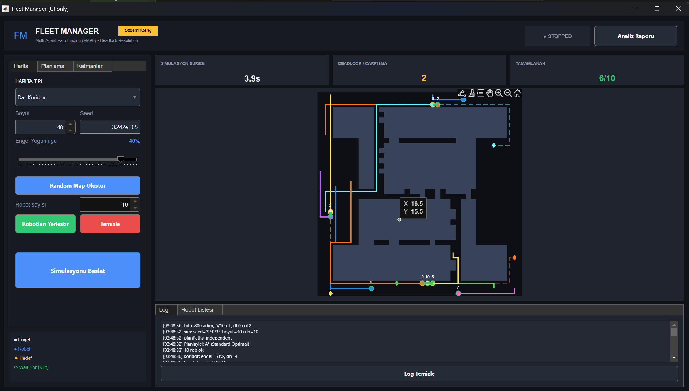
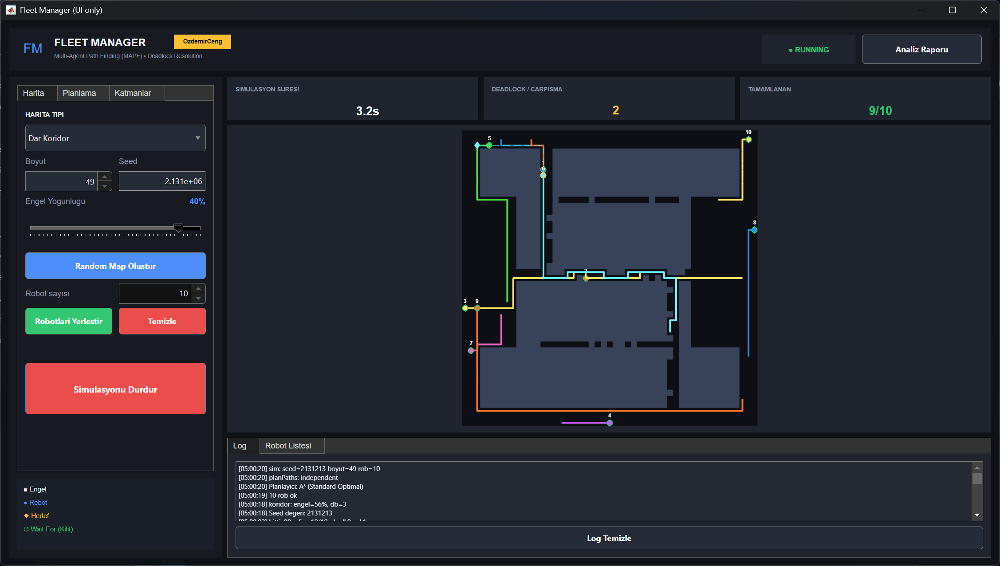
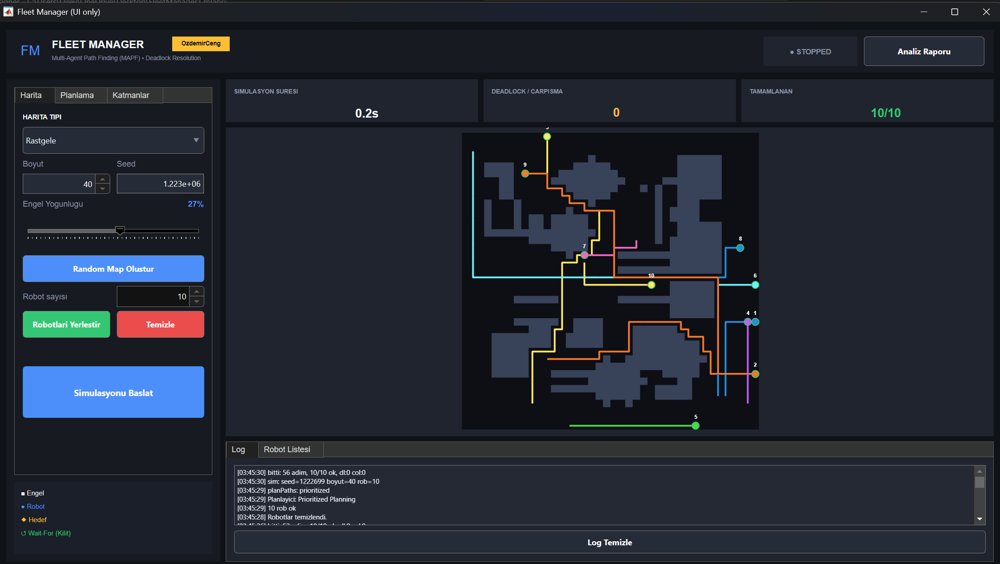
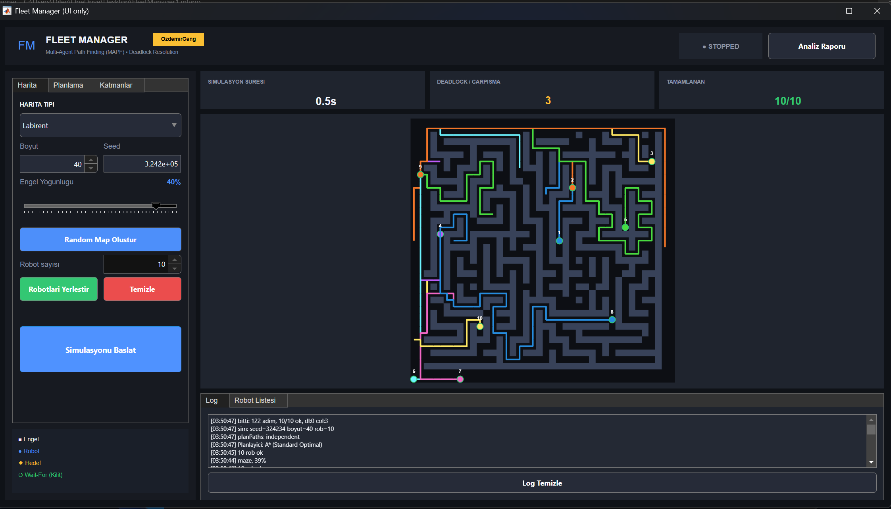
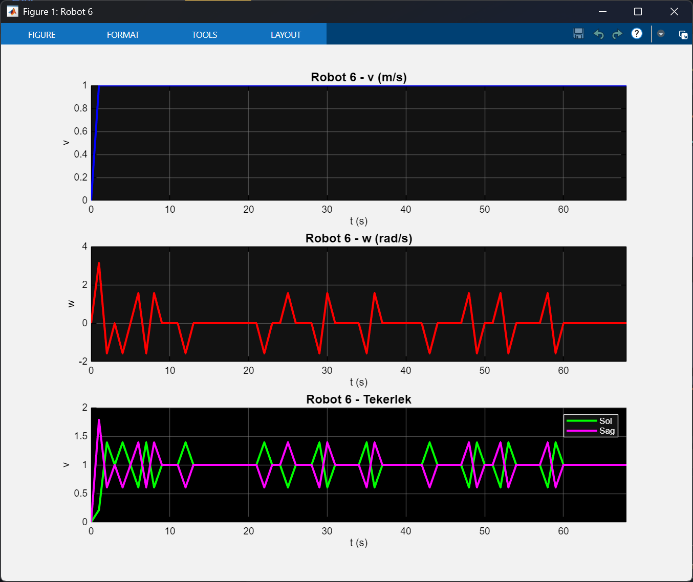

# 🤖 Fleet Manager Pro V7.0

**Multi-Robot Fleet Simulation System with A\* Pathfinding, Collision Detection & Deadlock Resolution**

A professional-grade MATLAB App Designer application that simulates multi-robot coordination in grid-based environments. The system demonstrates core robotics concepts including path planning, conflict resolution, and differential drive kinematics — all wrapped in a premium dark-themed UI.

---

## ✨ Features

### 🗺️ Map Generation

- **Random Maps** — Procedurally generated obstacles using geometric primitives (rectangles, L-shapes, U-shapes, parallel walls, ellipses)
- **Corridor Maps** — Narrow single-cell passages designed specifically for deadlock testing scenarios
- **Maze Maps** — Recursive backtracking algorithm for labyrinth generation
- **Seed Control** — Reproducible map generation with customizable seed values
- **Connectivity Validation** — BFS-based checks ensure all free space is reachable

### 🧭 Path Planning

- **A\* Algorithm** — Optimal pathfinding with configurable heuristics (Manhattan, Euclidean, Diagonal)
- **Multiple Planner Options** — Selectable planning strategies via dropdown
- **Distance Classes** — Robot start-goal distance categories: Close (5–15), Medium (15–30), Far (30+), Mixed

### 💥 Collision Detection & Resolution

- **Real-time Collision Detection** — Identifies when robots attempt to occupy the same cell
- **Deadlock Detection** — Detects mutual blocking situations between robots
- **Conflict Resolution Strategies** — Configurable via dropdown (wait, reroute, priority-based)
- **Mutual Passage Resolution** — Handles head-on corridor conflicts

### 📊 Analytics & Visualization

- **Real-time Metrics Dashboard** — Simulation time, step count, collisions, deadlocks, completion rate, efficiency
- **Statistics Graphs** — Collision and completion history over time
- **Wait Time Analysis** — Per-robot wait time visualization
- **Robot Status Table** — Live tracking of each robot's position, goal, and status
- **Velocity Profiles** — Differential drive kinematics with left/right wheel speed history

### 🎨 Premium UI

- **Dark Theme** — Professional dark color scheme with accent colors
- **Layer Controls** — Toggle visibility of paths, goals, trails, grid lines, and robot IDs
- **Interactive Controls** — Start/Stop, Step-by-step execution, speed slider, reset
- **Legend Panel** — Color-coded map element identification

---

## 🛠️ Requirements

- **MATLAB** R2020b or later
- **App Designer** (included with MATLAB)
- No additional toolboxes required

---

## 🚀 Getting Started

1. **Clone the repository**

   ```bash
   git clone https://github.com/ozdmromer24/fleetmanager.git
   cd fleetmanager
   ```

2. **Open in MATLAB**

   ```matlab
   open FleetManager.mlapp
   ```

3. **Run the application** — Click the **Run** button in App Designer, or:

   ```matlab
   FleetManager
   ```

4. **Workflow**
   1. Adjust **Map Size** and **Obstacle Density**, then click **Generate Map** (or use Corridor/Maze presets)
   2. Set the **Number of Robots** and **Distance Class**, then click **Place Robots**
   3. Choose **Planner** and **Conflict Resolution** strategy
   4. Click **▶ Start** to begin the simulation (use **Step** for single-step execution)

---

## 📸 Screenshots

### Collision Detection & Resolution

| Same-Cell Collision                                      | Mutual Passage Resolution                                 |
| -------------------------------------------------------- | --------------------------------------------------------- |
|  |  |

### Multi-Robot Coordination

| Collision-Free Multi-Robot                         | Maze with Collision Solving                                  |
| -------------------------------------------------- | ------------------------------------------------------------ |
|  |  |

### Analytics



---

## 🏗️ Architecture

```
FleetManager.mlapp
├── UI Components (App Designer)
│   ├── Left Panel — Map, Robot, Algorithm & Simulation controls
│   ├── Right Panel — Metrics cards, Map view, Tabs (Logs, Stats, Wait, Robot List)
│   └── Footer — Status bar, Progress, Legend
├── Map Generation
│   ├── generateRandomMap() — Shape-based procedural generation
│   ├── generateCorridorMap() — Narrow passage deadlock scenarios
│   ├── generateMazeMap() — Recursive backtracking
│   ├── ensureConnectivity() — BFS component analysis
│   └── validateMap() — Reachability verification
├── Path Planning
│   ├── aStarPath() — A* with configurable heuristics
│   └── calculateAllPaths() — Batch path computation
├── Simulation Engine
│   ├── simulationStep() — Core tick with movement & conflict checks
│   ├── detectCollisions() — Same-cell & swap detection
│   └── resolveDeadlocks() — Mutual blocking resolution
└── Kinematics
    ├── Differential drive model (WheelBase, WheelRadius)
    └── Velocity / Angular / Wheel speed history tracking
```

---

## 🔑 Key Algorithms

| Algorithm                         | Purpose                                                                |
| --------------------------------- | ---------------------------------------------------------------------- |
| **A\***                           | Optimal grid-based pathfinding with heuristic search                   |
| **BFS**                           | Map connectivity analysis & largest component detection                |
| **Recursive Backtracking**        | Maze generation                                                        |
| **Differential Drive Kinematics** | Left/right wheel velocity computation from linear & angular velocities |
| **Deadlock Detection**            | Cycle detection in robot wait-for graphs                               |

---

## 📄 Documentation

- **`raporobotik.pdf`** — Project report (Turkish) with detailed analysis and results

---

## 👤 Author

**Ömer Faruk Özdemir**

- 📧 [ozdmromer24@gmail.com](mailto:ozdmromer24@gmail.com)
- 💼 [LinkedIn](https://linkedin.com/in/ozdmromer24)

---

## 📝 License

This project was developed as a university course project for **Robot Motion Technology (RMT)**.
